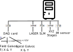

# Subsystems Description

### For Experiment

- Laser : 1040 nm femto second laser from Fatonics
- AOM : ?
- beam expander : ... from Lubang, between x2 to x10, set to x4
- SLM: HSP1920-850-1650-HSP8 from Meadowlark Optics
- Oth order filter (undiffracted light from SLM)
- Spiral galvanometer : 7mm aperture for Cambridge Technology
- Field galvanometer : 20 mm aperture from Sino-Galvo
- Tube + scan lens : large custom optics for High aperture and Large FOV 
- Scanning Light-Field Microscope (refered to as a single subsytem here)

### Extra for Calibration

- Monochrome sensor : 4032x3036 pixels with 1.85 um pixel size
- 3D translation stages : 50 mm range for Lubang - 3x EM-LSS65-50C1

## Laser
A low repetition rate laser of 6W average 

