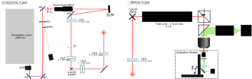

# OMNIS — Optical Mesoscale Neural Interrogation System

OMNIS is a platform designed to adress fundamental neuroscience questions : How does information flow between cortical regions during decision-making ? How does consciousness reflect on neural activity ?

We present a platform combining scanning light-field microscopy, and holographic stimulation to enable chronic multi-region neural circuit interrogation at mesoscopic scales and single at single-cell resolution.

The main advantages of this platform :
- 6 x 5 x 0.3 mm3 adressable volume for both imaging and stimulation, enabling multi-region experiments
- Low photoxicity, enabling long term studies
